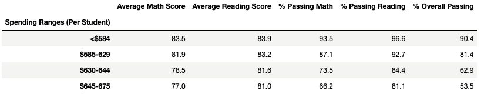
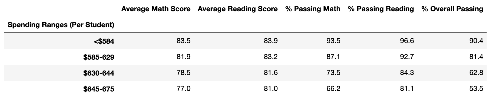
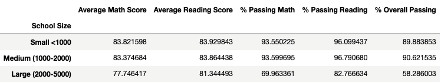
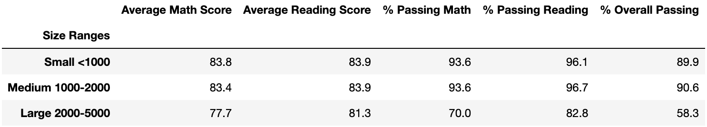
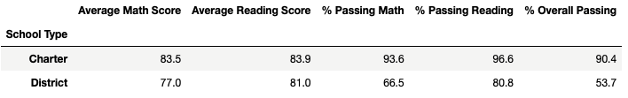
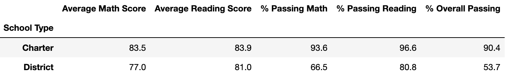

# Overview
## Purpose

The goal of this analysis was to aggregate a school district's test scores to showcase trends in school performance in order to help the schoolboard make decisions regarding budgets and school priorities. 

After academic dishonesty allegatations surfaced regarding Thomas High School's ninth grade, I was asked to repeat the analysis once again but with their test scores nullified. In my analysis, I have compared the two analyses in order to determine the ramificications the academic dishonesty had on Thomas High School and the district's aggregated test scores.

## Results
### District Summary

* District summary very slightly affected due to the large size of the student body in the district

### School Summary

* no other school in the district affected besides Thomas High School
* overall passing percentage slightly declined
* average math score slightly declined
* average math school slightly increased

### Thomas High School Performance Among District
 

 
* still ranked 2nd based on overall passing percentage in the district despite slightly lower overall passing percentage

### Math and reading scores by grade
* no changes despite Thomas High School's ninth grade receiving "nan" in both reading and math scores

### Scores by School Spending

* Math and eading scores per spending range largely unaffected by the replacement of the grades of the ninth graders at Thomas High School

### Scores by school size

* Math and reading scores per spending range largely unaffected by the replacement of the grades of the ninth graders at Thomas High School

### Scores by school type

* Math and reading scores per school type largely unaffected by the replacement of the grades of the ninth graders at Thomas High School

## Summary
Replacing the reading and math scores for the 9th grade at Thomas High School altered the initial analysis of the school district in many ways. 

The overall passing percentage for the district was slightly lowered, which would make logical sense becaude the cheaters were removed from the population.

Thomas High School went from a bottom tier ranking 