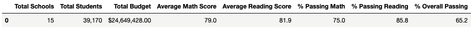
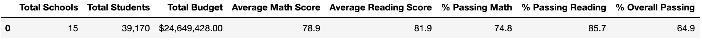
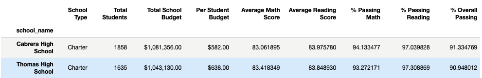
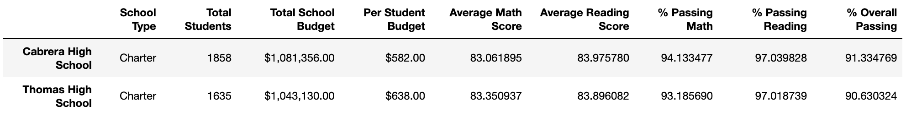

# Overview
## Purpose

The goal of this analysis was to aggregate a school district's test scores to showcase trends in school performance in order to help the school board make decisions regarding budgets and school priorities. 

After academic dishonesty allegations surfaced regarding Thomas High School's ninth grade, I was asked to repeat the analysis once again but with their test scores nullified. In my analysis, I have compared the two reports in order to determine the ramifications the academic dishonesty had on both the school and district's aggregated performance.

## Comparative Results

### District Summary

* District summary minimally affected by the grade nullification due to the immense size of the student body in the district

### School Summary

* No other school in the district affected besides Thomas High School
* Overall passing percentage declined slightly
* Math and reading passing percentage both declined slightly
* Average reading score very slightly increased

### Thomas High School Performance Among District
 

 
* Still ranked 2nd amongst the district based on overall passing percentage despite a slightly lower overall passing percentage after the ninth graders' scores were nullified

### Math and Reading Scores by Grade
[Math Score by Grade](./Resources/math_scores_by_level.png)

[Math Score by Grade with Replacement](./Resources/new_math_scores_by_level.png)

[Reading Score by Grade](./Resources/read_scores_by_level.png)

[Reading Score by Grade with Replacement](./Resources/new_read_scores_by_level.png)

* No changes despite Thomas High School's ninth grade receiving "nan" in both reading and math scores

### Scores by School Spending
[Scores by School Spending](./Resources/original_spending_df.png)

[Scores by School Spending with Replacement](./Resources/new_spending_df.png)

* Math and reading scores per spending range largely unaffected by the replacement of the grades of the ninth graders at Thomas High School
* Interestingly, schools with lower budgets per student performed better than those with higher budgets

### Scores by school size
[Score by School Size](./Resources/size_df_redo.png)

[Score by School Size with Replacement](./Resources/new_size_df.png)

* Math and reading scores per spending range largely unaffected by the replacement of the grades of the ninth graders at Thomas High School
* Schools with a "large" student body performed poorly overall and dragged down the aggregated district's metrics

### Scores by school type
[Score by School Type](./Resources/original_type_df.png)

[Score by School Type with Replacement](./Resources/new_type_df.png)

* Math and reading scores per school type largely unaffected by the replacement of the grades of the ninth graders at Thomas High School
* Charter schools largely outpaced district schools in math passing percentage, reading passing percentage, and overall passing percentage

## Summary
The nullification of grades largely had no effect on the analysis for two reasons: the 10th-12th graders at Thomas High School performed similarily to the ninth graders and the large sample size of students in the district made the changes almost indistinguishable. However, the new analysis produced three notable flucuations:

- The overall passing percentage for the district was slightly lowered after nullifying the allegedly dishonest test scores.

- Thomas High School's overall passing percentage was lowered slightly, but was not enough to unseat them from still ranking second in the district.

- Rather unexpectedly, Thomas High School's average reading score rose even after nullifying the ninth grade's scores.